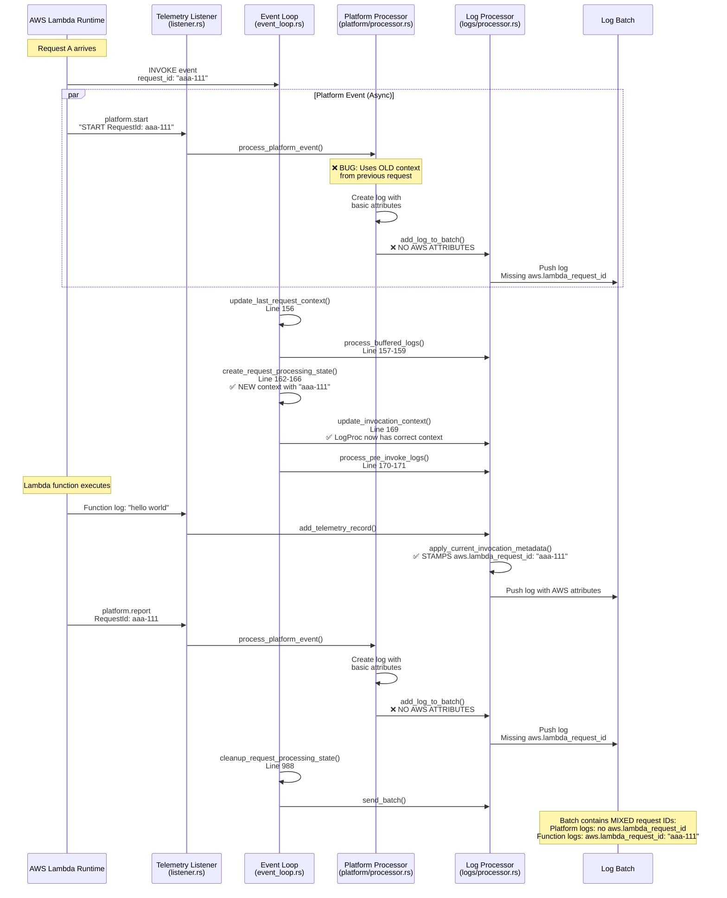
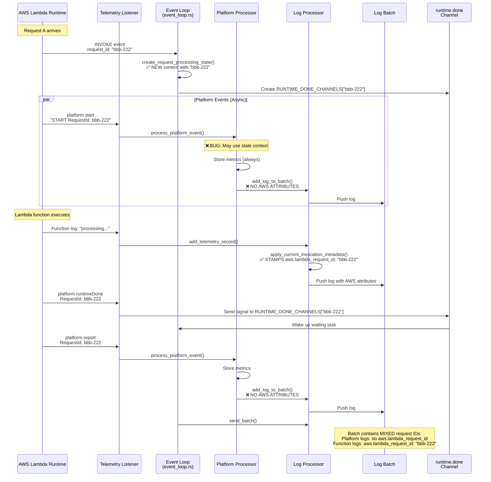
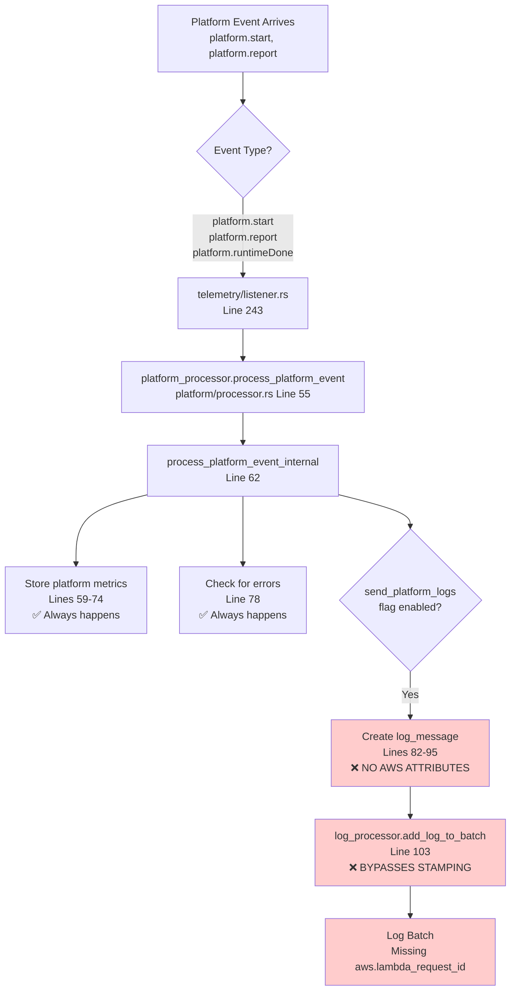
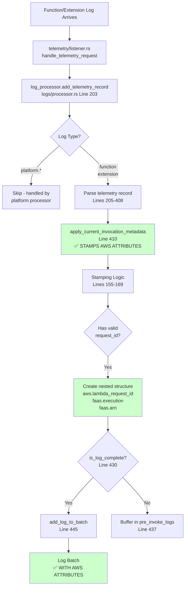
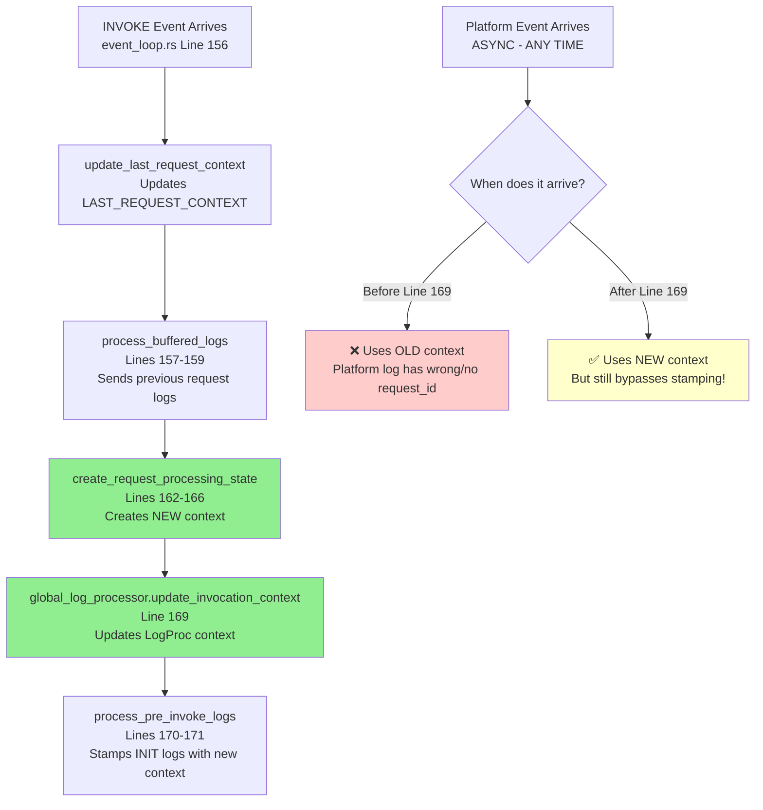
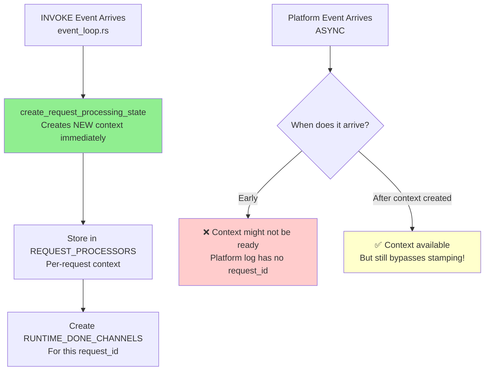
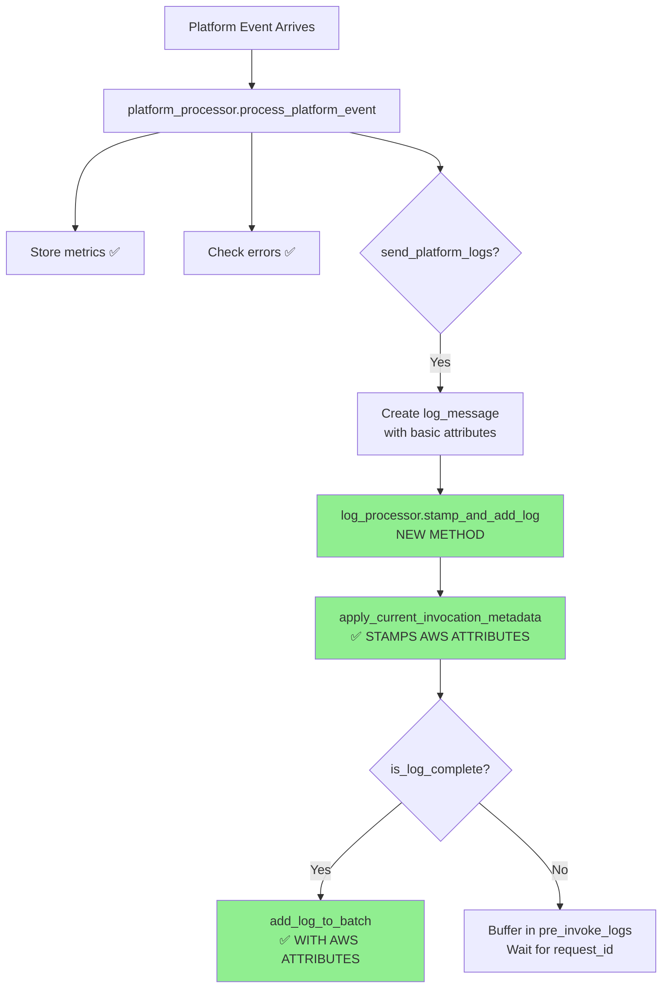

# Request ID Flow Analysis - APM Mode vs Standard Mode

## Overview

This document details how request IDs are stamped on logs in both APM and Standard modes, highlighting the critical bug where platform logs bypass AWS attribute stamping.

---

## 1. APM Mode - Invoke Event Flow



---

## 2. Standard Mode - Invoke Event Flow



---

## 3. Current Bug - Platform Log Processing Path



---

## 4. Correct Flow - Function/Extension Log Processing Path



---

## 5. The Problem: Two Different Code Paths

### Function/Extension Logs (CORRECT PATH)
```rust
// logs/processor.rs
pub fn add_telemetry_record(&self, record: TelemetryRecord) {
    // ... parse record ...
    
    // ✅ STAMPS AWS ATTRIBUTES HERE
    let log_message = self.apply_current_invocation_metadata(log_message);
    
    if self.is_log_complete(&log_message) {
        self.add_log_to_batch(log_message);  // Now has AWS attributes
    }
}

fn apply_current_invocation_metadata(&self, mut log_message: payload::LogMessage) 
    -> payload::LogMessage 
{
    if let Some(context) = self.invocation_context.safe_lock() {
        if !context.request_id.is_empty() && context.request_id != "unknown" {
            // ✅ Creates nested AWS structure
            let mut aws_attrs = serde_json::Map::new();
            aws_attrs.insert("lambda_request_id".to_string(),
                serde_json::Value::String(context.request_id.clone()));
            log_message.attributes.insert("aws".to_string(),
                serde_json::Value::Object(aws_attrs));
            
            log_message.attributes.insert("faas.execution".to_string(),
                serde_json::Value::String(context.request_id.clone()));
            log_message.attributes.insert("faas.arn".to_string(),
                serde_json::Value::String(context.invoked_function_arn.clone()));
        }
    }
    log_message
}
```

### Platform Logs (BROKEN PATH)
```rust
// platform/processor.rs
fn process_platform_event_internal(&self, event: &TelemetryEvent) {
    // ✅ Store metrics (always)
    self.store_platform_metrics(event);
    
    // ✅ Check for errors (always)
    self.check_and_send_platform_errors(event);
    
    // Create log if flag enabled
    if self.config.extension.send_platform_logs {
        let mut attributes = serde_json::Map::new();
        attributes.insert("log_type".to_string(), serde_json::json!("platform"));
        // ... add other attributes ...
        
        // ❌ NO AWS ATTRIBUTES ADDED HERE
        
        let log_message = crate::newrelic::payload::LogMessage {
            timestamp,
            message,
            attributes,  // ❌ Missing aws.lambda_request_id
        };
        
        // ❌ DIRECTLY TO BATCH - BYPASSES apply_current_invocation_metadata
        self.log_processor.add_log_to_batch(log_message);
    }
}
```

---

## 6. Why Request IDs Get Mixed Up

### Scenario Timeline

| Time | Event | Context State | What Gets Logged |
|------|-------|---------------|------------------|
| T0 | Request A completes | request_id: "aaa-111" | - |
| T1 | Request B INVOKE arrives | request_id: "aaa-111" (old) | - |
| T2 | platform.start for B arrives async | request_id: "aaa-111" (old) | ❌ Platform log with NO aws.lambda_request_id |
| T3 | Event loop creates new context | request_id: "bbb-222" (new) | - |
| T4 | Event loop updates LogProc context | request_id: "bbb-222" (new) | - |
| T5 | Function log arrives | request_id: "bbb-222" (new) | ✅ Function log with aws.lambda_request_id: "bbb-222" |
| T6 | platform.report arrives | request_id: "bbb-222" (new) | ❌ Platform log with NO aws.lambda_request_id |
| T7 | Batch sent | - | **MIXED: Some logs have correct request_id, others have none** |

### Result in Batch
```json
[
  {
    "message": "START RequestId: bbb-222",
    "log_type": "platform",
    // ❌ NO aws.lambda_request_id
    // ❌ NO faas.execution
    // ❌ NO faas.arn
  },
  {
    "message": "hello from function",
    "log_type": "function",
    "aws": { "lambda_request_id": "bbb-222" },  // ✅ Correct
    "faas.execution": "bbb-222",                 // ✅ Correct
    "faas.arn": "arn:aws:lambda:..."             // ✅ Correct
  },
  {
    "message": "REPORT RequestId: bbb-222...",
    "log_type": "platform",
    // ❌ NO aws.lambda_request_id
    // ❌ NO faas.execution
    // ❌ NO faas.arn
  }
]
```

### What Happens at New Relic Ingestion

When this batch is sent to New Relic Logs API, the validation might:

1. **Reject incomplete logs** → Platform logs get dropped
2. **Try to infer request_id** → Platform logs get wrong request_id from pre-invoke processing
3. **Group by common attributes** → Logs from different requests get mixed together
4. **Fail batch** → Entire batch rejected

---

## 7. Context Update Timing

### APM Mode Context Flow



### Standard Mode Context Flow



---

## 8. The Fix Required

### Make Platform Logs Go Through Same Stamping Path



### Changes Needed

1. **logs/processor.rs**: Add public method `stamp_and_add_log()` that:
   - Calls `apply_current_invocation_metadata()`
   - Validates with `is_log_complete()`
   - Adds to batch or buffers appropriately

2. **platform/processor.rs**: Change line 103 from:
   ```rust
   self.log_processor.add_log_to_batch(log_message);
   ```
   To:
   ```rust
   self.log_processor.stamp_and_add_log(log_message);
   ```

3. **Consider buffering platform logs**: If context isn't ready, buffer them like function logs instead of adding to batch immediately.

---

## 9. Log Validation Flow

### Current Validation in logs/processor.rs

```rust
fn is_log_complete(&self, log: &payload::LogMessage) -> bool {
    // Check for faas.arn
    let has_arn = log.attributes.get("faas.arn")
        .and_then(|v| v.as_str())
        .map(|s| !s.is_empty())
        .unwrap_or(false);
    
    // Check for nested aws.lambda_request_id
    let has_request_id = log.attributes.get("aws")
        .and_then(|v| v.as_object())
        .and_then(|obj| obj.get("lambda_request_id"))
        .and_then(|v| v.as_str())
        .map(|s| !s.is_empty() && s != "unknown")
        .unwrap_or(false);
    
    has_arn && has_request_id
}
```

### Platform Logs FAIL This Check

Because platform logs bypass `apply_current_invocation_metadata()`, they:
- ❌ Don't have `aws.lambda_request_id`
- ❌ Don't have `faas.execution`
- ❌ Don't have `faas.arn`

This means they're INCOMPLETE and should be buffered or rejected, but currently they go straight to the batch!

---

## 10. Summary

### Current State
- **Function/Extension logs**: ✅ Correctly stamped with AWS attributes via `apply_current_invocation_metadata()`
- **Platform logs**: ❌ Bypass stamping, go directly to batch with incomplete metadata

### Root Cause
Platform logs take a different code path that calls `add_log_to_batch()` directly instead of going through the stamping logic.

### Impact
- Platform logs have no `aws.lambda_request_id` attribute
- Logs from different requests get mixed in the same batch
- New Relic ingestion may reject incomplete logs
- User sees mismatched request IDs in their logs

### Solution
Make platform logs go through the same stamping and validation flow as function/extension logs by creating a new public method in LogProcessor that platform processor can call.

---

## Code References

### Key Files
- **event_loop.rs**: Lines 140-200 (APM mode invoke handling)
- **logs/processor.rs**: 
  - Lines 155-169 (apply_current_invocation_metadata)
  - Lines 203-450 (add_telemetry_record with stamping)
  - Lines 577-597 (is_log_complete validation)
- **platform/processor.rs**: Lines 55-105 (process_platform_event_internal)
- **telemetry/listener.rs**: Lines 100-250 (async HTTP listener)

### Context Management
- **request.rs**: Lines 80-135 (create_request_processing_state)
- **context.rs**: InvocationContext structure with request_id, arn, trace_id
